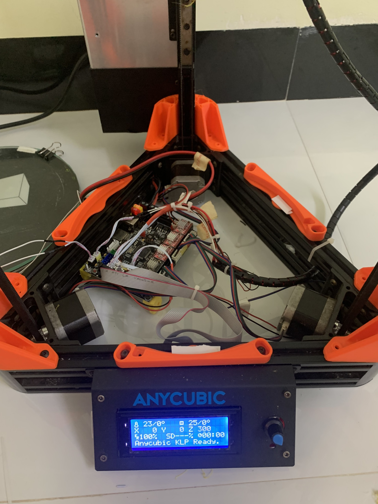
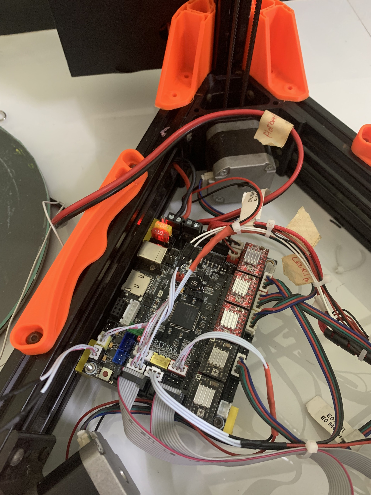

# Marlin 2.0.x for Anycubic Kossel Line Plus with BTT SKR 1.4 Board

This is a customized version of Marlin 2.0.x that has been configured to work with the BTT SKR 1.4 board for the Anycubic Kossel Line Plus 3D printer. This firmware has several pin modifications to better suit the BTT SKR 1.4 and A4988 driver. Additionally, it has been configured to support ESP-01S. Simply build [ESP3D](https://github.com/luc-github/ESP3D) onto ESP-01S, plug it into the board, and you can operate the printer interface on a web browser. 

## Installation

To install this firmware, you need to:
- Clone this repository to your machine
- Build the source code using an appropriate tool (e.g., PlatformIO)
- Flash the successfully built firmware onto the BTT SKR 1.4 board

## Pin Configuration

Please note that the pin configuration for the endstop sensors must match the configuration in the file `\Marlin\src\pins\lpc1768\pins_BTT_SKR_V1_4.h`. Misconfiguration can result in malfunction or damage to the 3D printer.

## Warning

Make sure you know what you are doing. Misconfiguration of the firmware can damage your 3D printer. I am not responsible for any damage arising from the use of this firmware.

## Contributions

All contributions are welcome. If you discover a bug or have an improvement, please create a pull request.

## Origin

This firmware is based on the original Marlin 2.0.x firmware which can be found at [Marlin Firmware Configurations](https://github.com/MarlinFirmware/Marlin).

## Contact

If you have any questions or encounter any issues, please create an issue in this repository.

## Images

